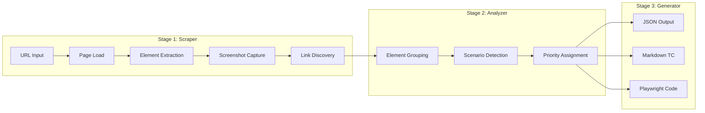
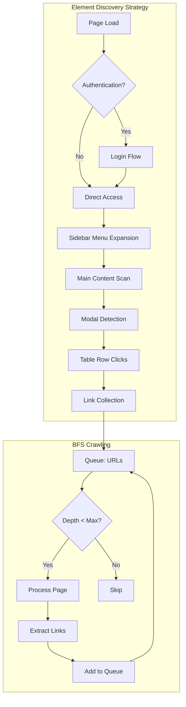
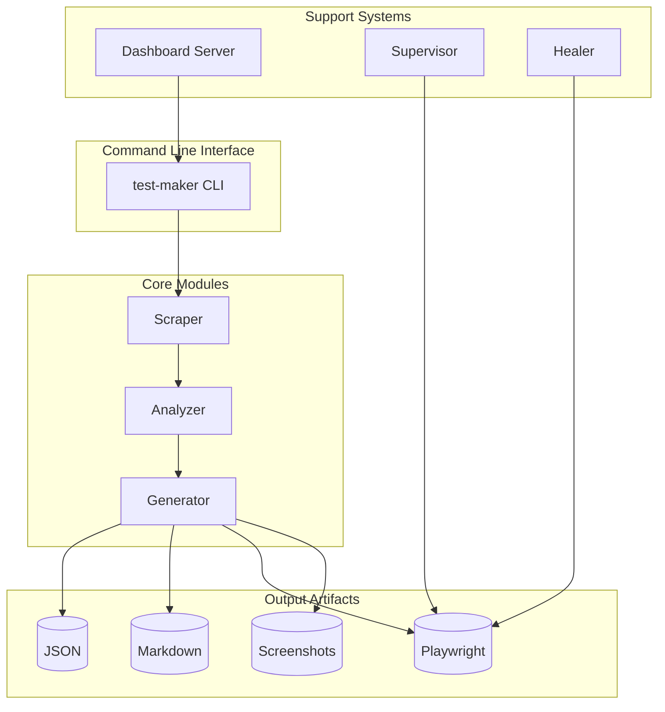
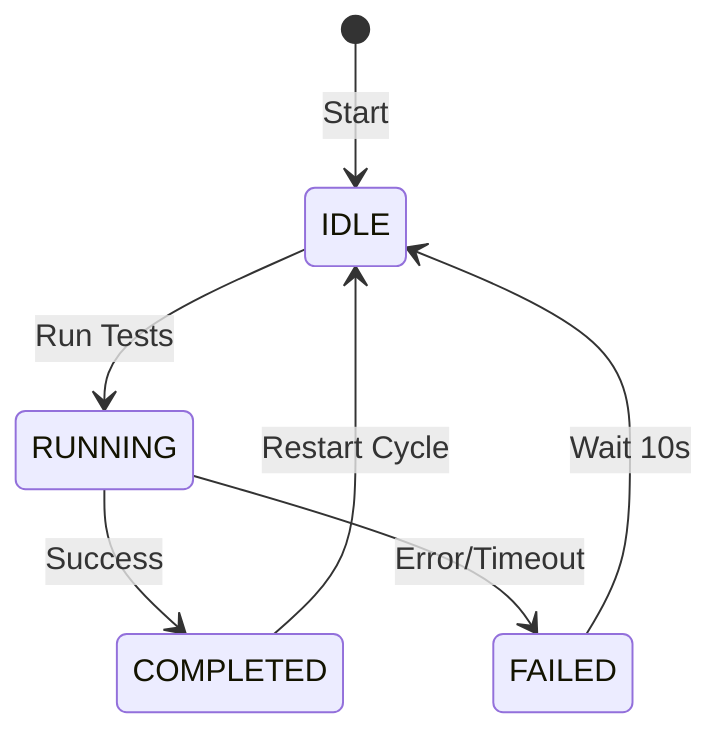

# TestMaker

**Playwright 기반 자동 테스트 케이스 생성 도구**

웹 애플리케이션을 자동으로 분석하여 테스트 가능한 요소를 추출하고, 테스트 케이스(TC) 문서와 Playwright 테스트 코드를 자동 생성합니다.

---

## 목차

- [프로젝트 개요](#프로젝트-개요)
- [주요 기능](#주요-기능)
- [아키텍처](#아키텍처)
- [설치](#설치)
- [사용법](#사용법)
- [출력 구조](#출력-구조)
- [Dashboard](#dashboard)
- [Supervisor](#supervisor)
- [Self-Healing](#self-healing)
- [환경 변수](#환경-변수)
- [프로젝트 구조](#프로젝트-구조)

---

## 프로젝트 개요

### 해결하고자 하는 문제

수동 테스트 케이스 작성은 시간이 많이 소요되고 누락이 발생하기 쉽습니다. 특히 SPA(Single Page Application) 환경에서는 동적 요소 탐지가 어렵고, UI 변경 시 테스트 유지보수 비용이 큽니다.

### 솔루션

TestMaker는 웹 페이지를 자동으로 크롤링하여:
1. **테스트 가능한 요소**를 자동 식별 (버튼, 입력 필드, 링크 등)
2. **테스트 시나리오**를 자동 그룹화 (폼 제출, 네비게이션, CRUD 등)
3. **실행 가능한 테스트 코드**를 자동 생성 (Playwright .spec.ts)

```
┌─────────────────────────────────────────────────────────────────────┐
│                         TestMaker Pipeline                          │
├─────────────────────────────────────────────────────────────────────┤
│                                                                     │
│   ┌─────────┐      ┌──────────┐      ┌───────────┐      ┌────────┐  │
│   │   URL   │ ───▶ │ Scraper  │ ───▶ │ Analyzer  │ ───▶ │ Output │  │
│   └─────────┘      └──────────┘      └───────────┘      └────────┘  │
│                         │                  │                 │      │
│                    ┌────▼────┐        ┌────▼────┐      ┌─────▼────┐ │
│                    │ Elements│        │Scenarios│      │ JSON     │ │
│                    │ Extract │        │ Grouping│      │ Markdown │ │
│                    │ Screenshot       └─────────┘      │ Playwright│
│                    └─────────┘                         └──────────┘ │
│                                                                     │
└─────────────────────────────────────────────────────────────────────┘
```

---

## 주요 기능

### Core Features

| 기능 | 설명 |
|------|------|
| **Multi-page Crawling** | BFS 알고리즘으로 연결된 페이지 자동 탐색 |
| **Element Detection** | 버튼, 입력필드, 링크, 모달, 테이블 등 자동 식별 |
| **Scenario Grouping** | 관련 요소를 테스트 시나리오로 자동 그룹화 |
| **Code Generation** | Playwright .spec.ts 파일 자동 생성 |
| **Screenshot Capture** | 각 페이지 스크린샷 자동 저장 (WebP 최적화) |
| **Authentication** | 로그인 상태 유지 및 인증 지원 |

### Advanced Features

| 기능 | 설명 |
|------|------|
| **Dashboard** | 웹 기반 결과 조회 및 분석 실행 UI |
| **Supervisor** | 테스트 프로세스 감독 및 자동 재시작 |
| **Self-Healing** | 테스트 실패 시 컨텍스트 캡처 및 자동 복구 지원 |
| **Modal Discovery** | 모달 다이얼로그 내부 요소 자동 탐색 |
| **Row-Click Discovery** | 테이블 행 클릭으로 상세 페이지 탐색 |
| **Menu Expansion** | 사이드바/네비게이션 메뉴 자동 확장 |

---

## 아키텍처

### 3단계 파이프라인



### 탐색 전략



### 시스템 구성



---

## 설치

### 요구 사항

- Node.js 18+
- npm 또는 yarn

### 설치 방법

```bash
# 프로젝트 디렉토리로 이동
cd testMaker

# 의존성 설치
npm install

# Playwright 브라우저 설치
npx playwright install chromium
```

---

## 사용법

### 기본 사용

```bash
# 단일 페이지 분석
npm run analyze -- --url https://example.com

# 재귀 모드 (연결된 페이지 자동 탐색)
npm run analyze -- --url https://example.com --recursive --depth 3

# 최대 페이지 수 제한
npm run analyze -- --url https://example.com --recursive --limit 50

# 브라우저 표시 모드 (디버깅)
npm run analyze -- --url https://example.com --no-headless

# 캐시 무시하고 재분석
npm run analyze -- --url https://example.com --force
```

### CLI 옵션

| 옵션 | 설명 | 기본값 |
|------|------|--------|
| `--url <url>` | 분석할 URL | `TESTMAKER_URL` 환경변수 |
| `--output-dir <path>` | 출력 디렉토리 | `./output` |
| `--depth <n>` | 최대 탐색 깊이 | `1` |
| `--limit <n>` | 최대 페이지 수 | `50` |
| `--format <type>` | 출력 형식 (markdown/playwright/both) | `both` |
| `--screenshots` | 스크린샷 포함 | `true` |
| `--auth-file <path>` | 인증 상태 파일 | `TESTMAKER_AUTH_FILE` |
| `--username <user>` | 로그인 사용자명 | `emailname` 환경변수 |
| `--password <pass>` | 로그인 비밀번호 | `password` 환경변수 |
| `--recursive` | 재귀 모드 활성화 | `false` |
| `--force` | 캐시 무시 | `false` |
| `--headless/--no-headless` | 헤드리스 모드 | `true` |

### 인증이 필요한 사이트

```bash
# 환경 변수로 인증 정보 설정
export emailname="user@example.com"
export password="your-password"

# 분석 실행 (자동 로그인)
npm run analyze -- --url https://app.example.com/dashboard --recursive
```

---

## 출력 구조

```
output/
├── json/                          # 분석 결과 JSON
│   └── {domain}/
│       └── {domain}-{path}.json   # 페이지별 분석 데이터
│
├── markdown/                      # TC 문서
│   └── {domain}/
│       └── {domain}-{path}.md     # 테스트 케이스 문서
│
├── playwright/                    # Playwright 테스트 코드
│   └── {domain}/
│       └── {domain}-{path}.spec.ts
│
├── screenshots/                   # 페이지 스크린샷
│   └── {domain}/
│       └── {path}.webp
│
├── temp-auth.json                 # 인증 상태 캐시
└── supervisor.log                 # Supervisor 로그
```

### JSON 출력 예시

```json
{
  "pageInfo": {
    "url": "https://example.com/app/users",
    "title": "User Management",
    "domain": "example.com",
    "path": "/app/users"
  },
  "elements": [
    {
      "id": "elem-001",
      "selector": "button[data-testid='add-user']",
      "testId": "add-user",
      "tag": "button",
      "type": "button",
      "label": "Add User",
      "state": { "visible": true, "enabled": true }
    }
  ],
  "scenarios": [
    {
      "id": "scenario-001",
      "name": "User CRUD Operations",
      "category": "crud-operation",
      "priority": 1,
      "actions": [...]
    }
  ],
  "discoveredLinks": ["https://example.com/app/users/new"],
  "screenshot": "users.webp"
}
```

---

## Dashboard

웹 기반 대시보드로 분석 결과를 조회하고 분석을 실행할 수 있습니다.

### 실행

```bash
npm run dashboard
```

### 기능

```
http://localhost:3000
├── /                    # 메인 대시보드
├── /api/analyze         # 분석 실행 API (POST)
├── /api/status          # 분석 상태 조회
└── /screenshots/*       # 스크린샷 조회
```

### 인증

```bash
export DASHBOARD_USER="admin"
export DASHBOARD_PASS="secure-password"
npm run dashboard
```

---

## Supervisor

테스트 프로세스를 감독하고 실패 시 자동으로 재시작합니다.

### 실행

```bash
npm run start:supervisor
```

### 기능

- **Watchdog Timer**: 5분간 출력 없으면 행(hang) 감지
- **Auto Restart**: 프로세스 실패 시 10초 후 자동 재시작
- **Status Tracking**: `output/supervisor_status.json`에 상태 기록
- **Logging**: `output/supervisor.log`에 활동 로그



---

## Self-Healing

테스트 실패 시 자동 복구를 위한 컨텍스트를 캡처합니다.

### 캡처 데이터

| 데이터 | 용도 |
|--------|------|
| **HTML Snapshot** | 실패 시점의 DOM 상태 |
| **Accessibility Tree** | 의미론적 요소 구조 |
| **Error Metadata** | 오류 정보 및 URL |

### 사용 방법

```typescript
// tests/example.spec.ts
import { captureHealingContext } from '../src/core/healer';

test.afterEach(async ({ page }, testInfo) => {
    await captureHealingContext(page, testInfo);
});
```

---

## 환경 변수

`.env` 파일 또는 환경 변수로 설정:

```bash
# 분석 대상
TESTMAKER_URL=https://example.com
TESTMAKER_AUTH_FILE=./auth-state.json

# 로그인 정보
emailname=user@example.com
password=your-password

# Dashboard 인증
DASHBOARD_USER=admin
DASHBOARD_PASS=secure-password
```

---

## 프로젝트 구조

```
testMaker/
├── src/
│   ├── core/
│   │   ├── cli.ts           # CLI 진입점
│   │   ├── scraper.ts       # 페이지 스크래핑 (948 LOC)
│   │   ├── supervisor.ts    # 프로세스 감독
│   │   └── healer.ts        # Self-healing 컨텍스트 캡처
│   │
│   ├── dashboard/
│   │   ├── server.ts        # HTTP 서버
│   │   └── scripts/         # 프론트엔드 스크립트
│   │
│   └── scripts/
│       ├── analyzer.ts      # 요소 분석 및 그룹화
│       └── generator.ts     # TC/Playwright 코드 생성
│
├── types/
│   └── index.ts             # TypeScript 타입 정의
│
├── templates/               # Handlebars 템플릿
│
├── tests/                   # 생성된 Playwright 테스트
│   └── golden_paths/        # Golden Path 테스트
│
├── output/                  # 분석 결과
│   ├── json/
│   ├── markdown/
│   ├── playwright/
│   └── screenshots/
│
├── package.json
├── playwright.config.ts
└── tsconfig.json
```

---

## 타입 정의

### TestableElement

```typescript
interface TestableElement {
    id: string;                    // 고유 식별자
    selector: string;              // CSS 선택자
    testId?: string;               // data-testid
    tag: string;                   // HTML 태그
    type: ElementType;             // 요소 타입
    label: string;                 // 텍스트/라벨
    rect: { top, left, width, height };
    state: { visible, enabled, required };
    attributes: Record<string, string>;
}
```

### ElementType

```typescript
type ElementType =
    | 'button' | 'link' | 'text-input' | 'textarea'
    | 'select' | 'checkbox' | 'radio' | 'file-input'
    | 'dialog' | 'tab' | 'menu' | 'accordion' | 'custom';
```

### TestScenario

```typescript
interface TestScenario {
    id: string;
    name: string;
    category: ScenarioCategory;
    description: string;
    actions: TestAction[];
    priority: 1 | 2 | 3;
}
```

---

## 현재 구현 상태

### 구현 완료

- [x] 3단계 파이프라인 (Scraper → Analyzer → Generator)
- [x] BFS 기반 Multi-page 탐색
- [x] 인증 지원 (수동/자동 로그인)
- [x] 사이드바 메뉴 자동 확장
- [x] 모달 다이얼로그 탐색
- [x] 테이블 행 클릭 탐색
- [x] WebP 스크린샷 최적화
- [x] Dashboard 웹 UI
- [x] Supervisor 프로세스 관리
- [x] Self-Healing 컨텍스트 캡처

### 추후 개발 예정

- [x] SPA 라우트 인터셉션 (Phase 6) ✅
- [x] 네비게이션 버튼 클릭 탐색 (Phase 7) ✅
- [x] 탭/아코디언 콘텐츠 탐색 (Phase 8) ✅
- [x] iframe 콘텐츠 탐색 (Phase 9) ✅
- [x] 프레임워크별 Link 감지 (Phase 10) ✅
- [ ] BDD (Gherkin) 지원
- [ ] AI 기반 예상 결과 추론

---

## 라이센스

ISC

---

## 기여

이슈 및 PR 환영합니다.