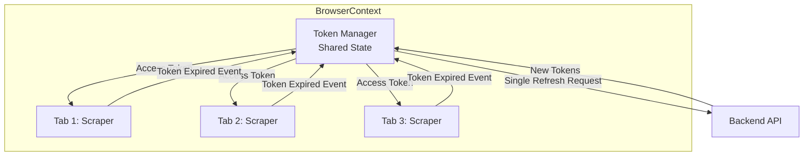

# Multi-Tab Token Management Strategy

> **Status**: 향후 적용을 고려 중인 계획  
> **Created**: 2026-01-16  
> **Prerequisites**: 백엔드 토큰 갱신 API 안정화

---

## Background

### 현재 상황

**원래 설계**:
- TestMaker는 **3개 탭 병렬 탐색**으로 설계됨 (`runner.ts` Line 32)
- 멀티탭으로 탐색 속도를 3배 향상시키는 것이 목표

**현재 운영**:
- CLI 기본값을 **1개 탭**으로 변경 (`cli.ts` Line 20)
- 이유: 토큰 충돌 및 성능 이슈로 안정성 우선 선택

**핵심 문제**:
- 백엔드 토큰 갱신 API에 오류 존재
- 여러 탭이 동시에 토큰 갱신 시도 → 세션 충돌 발생
- 빈번한 refresh 요청 → 로딩 시간 증가 및 403 에러

---

## Challenge

### Issue 1: Token Refresh Conflicts

**문제**:
```
Tab 1 → Access Token 만료 감지 → Refresh Token 요청
Tab 2 → Access Token 만료 감지 → Refresh Token 요청 (동시)
Tab 3 → Access Token 만료 감지 → Refresh Token 요청 (동시)
```

**결과**:
- 여러 탭이 동시에 refresh 요청 → 백엔드 API 오류
- 일부 탭의 세션이 무효화됨
- 403 에러로 탐색 중단

### Issue 2: Performance Bottleneck

**문제**:
- 각 API 호출마다 토큰 유효성 검증
- Refresh 요청 자체가 느림 (백엔드 이슈)
- 여러 탭이 대기 → 전체 처리 속도 저하

**측정된 영향**:
- 토큰 갱신 요청 빈도가 로딩 시간에 직접적 영향
- Dev 환경에서 페이지당 로딩 시간 증가 관찰됨

### Issue 3: State Management

**문제**:
- 각 탭(Playwright Page)이 독립적인 토큰 상태 관리
- BrowserContext 레벨에서 토큰 공유 메커니즘 없음
- 탭 간 토큰 동기화 불가

---

## Proposed Solution

### Architecture



### Core Concepts

#### 1. Access Token / Refresh Token 이원화

**현재**:
- 토큰이 단일 상태로 관리됨
- 만료 시점 예측 불가

**개선**:
```typescript
interface TokenState {
  accessToken: string;
  refreshToken: string;
  expiresAt: number;      // 만료 시점 (timestamp)
  isRefreshing: boolean;  // 갱신 진행 중 플래그
}
```

**이점**:
- 만료 전 proactive refresh 가능
- 갱신 중 중복 요청 방지

#### 2. 탭 간 토큰 상태 공유

**구현 방법**:
- BrowserContext의 `storageState` 활용
- 또는 별도 `TokenManager` 클래스 (싱글톤)

**동작**:
```typescript
class TokenManager {
  private static instance: TokenManager;
  private tokenState: TokenState;
  private refreshPromise?: Promise<void>;
  
  async getAccessToken(): Promise<string> {
    // 만료 임박 시 자동 갱신
    if (this.isExpiringSoon()) {
      await this.refreshIfNeeded();
    }
    return this.tokenState.accessToken;
  }
  
  private async refreshIfNeeded() {
    // 중복 갱신 방지 (debounce)
    if (this.refreshPromise) {
      return this.refreshPromise;
    }
    
    this.refreshPromise = this.doRefresh();
    await this.refreshPromise;
    this.refreshPromise = undefined;
  }
}
```

#### 3. 탭 분류 및 역할 할당

**목적**: 탭 간 작업 분리로 충돌 최소화

**전략 A - 균등 분배**:
```
Tab 1: Queue[0, 3, 6, 9, ...]
Tab 2: Queue[1, 4, 7, 10, ...]
Tab 3: Queue[2, 5, 8, 11, ...]
```

**전략 B - 역할 기반**:
```
Tab 1 (Leader): Token 관리 책임, 일반 탐색
Tab 2 (Worker): 일반 탐색
Tab 3 (Worker): 일반 탐색
```

**권장**: 전략 A (균등 분배) - 구현 단순, 부하 분산 우수

---

## Implementation Phases

### Phase 1: Token Manager 설계 및 구현

**목표**: 단일 토큰 상태 관리 모듈 생성

**Tasks**:
- [ ] `src/core/TokenManager.ts` 생성
- [ ] `TokenState` 인터페이스 정의
- [ ] `getAccessToken()`, `refreshToken()` 구현
- [ ] Refresh debounce 로직 추가
- [ ] 만료 시점 예측 (expiresAt - 60s = refresh threshold)

**검증**:
- 단일 탭 환경에서 정상 동작 확인
- Token 갱신 로그 확인 (중복 요청 없어야 함)

---

### Phase 2: 멀티탭 통합 및 안정성 검증

**목표**: 3개 탭에서 TokenManager 공유

**Tasks**:
- [ ] `runner.ts`에 TokenManager 싱글톤 주입
- [ ] Scraper가 TokenManager 사용하도록 리팩토링
- [ ] NetworkManager와 통합 (헤더 주입 시 TokenManager 사용)
- [ ] 탭별 로그로 토큰 갱신 추적

**검증**:
- `--concurrency 3`으로 실행
- 동시에 여러 페이지 탐색 시 토큰 충돌 없어야 함
- 로그에서 refresh 요청이 **1회만** 발생하는지 확인

---

### Phase 3: 성능 최적화 및 모니터링

**목표**: 탐색 속도 향상 측정

**Tasks**:
- [ ] 성능 메트릭 수집 (페이지당 평균 로딩 시간)
- [ ] 1탭 vs 3탭 비교 벤치마크
- [ ] Dashboard에 토큰 갱신 빈도 표시
- [ ] Error recovery 로직 강화 (refresh 실패 시)

**검증**:
- Stage 환경에서 장시간 실행 (50+ pages)
- 세션 유지 안정성 확인
- 탐색 속도가 1탭 대비 2배 이상 향상되는지 확인

---

## Prerequisites

### 백엔드 요구사항

**필수**:
- [ ] 토큰 갱신 API 안정화 (`/api/auth/refresh`)
- [ ] 동시 refresh 요청 처리 (idempotent)
- [ ] Token expiry 시간 명시 (response에 `expiresIn` 포함)

**선택**:
- [ ] Rate limiting 완화 (3개 탭 병렬 지원)
- [ ] 토큰 갱신 빈도 최적화 (expiry 시간 연장)

### 프론트엔드 준비

- [ ] `BLOCK_REFRESH_TOKEN` workaround 제거 가능 여부 확인
- [ ] NetworkManager 리팩토링 (TokenManager 의존성 주입)
- [ ] 기존 인증 흐름과 호환성 확인

---

## Expected Benefits

### 성능 향상

| 항목 | 1 Tab (현재) | 3 Tabs (목표) | 개선율 |
|------|--------------|---------------|--------|
| 50 페이지 탐색 | ~15분 | ~5분 (예상) | **3배** |
| 평균 페이지 로딩 | 18초 | 6초 (예상) | **3배** |
| 토큰 갱신 빈도 | 매 요청마다 | 필요 시만 | 감소 |

### 안정성 향상

- 토큰 충돌 해소 → 403 에러 감소
- Proactive refresh → 세션 유지 안정성 향상
- 중복 요청 방지 → 백엔드 부하 감소

### 확장성

- 탭 개수 동적 조정 가능 (`--concurrency N`)
- 향후 분산 실행 가능성 (여러 머신에서 탭 분산)

---

## Risks & Mitigation

### Risk 1: 백엔드 미준비

**위험**: 토큰 갱신 API가 여전히 불안정

**완화**:
- Phase 1 완료 후 백엔드 팀에 검증 요청
- 문제 발견 시 `--concurrency 1`로 롤백 가능
- Workaround 유지 (긴급 사용)

### Risk 2: 복잡도 증가

**위험**: TokenManager 도입으로 코드 복잡도 상승

**완화**:
- 명확한 인터페이스 설계
- 단위 테스트 작성 (vitest)
- 기존 코드와 점진적 통합

### Risk 3: 예상 성능 미달

**위험**: 3탭이 1탭보다 느릴 가능성

**완화**:
- Phase 2에서 성능 벤치마크 필수
- 성능 개선이 없으면 Phase 3 중단 고려

---

## Next Steps

1. **백엔드 팀과 협의**: 토큰 API 안정화 일정 확인
2. **Phase 1 착수**: TokenManager 프로토타입 구현
3. **단위 테스트**: Token refresh 로직 검증
4. **Stage 환경 검증**: 1탭 환경에서 안정성 확인
5. **Phase 2 진행**: 멀티탭 통합 및 검증

---

## Related Documents

- [architecture/systems.md](../architecture/systems.md#token-management) - 현재 상태 및 workaround
- [history/known-issues.md](../history/known-issues.md) - 토큰 관련 문제 이력
- [PROJECT_BRIEFING.md](../PROJECT_BRIEFING.md) - 전체 아키텍처 개요

---

Last Updated: 2026-01-16
